```{r setup, include=FALSE}
knitr::opts_chunk$set(echo = FALSE)
library(knitr)

```

## R_Junkies | Group members:

+ Yağmur Ulutürk Tekten
+ Cem Gürkan
+ Rezan Azizoğlu
+ Semih Tekten

<br>
Big Data Analytics<br>
BDA 503, 2017<br>
Berk Orbay

## Dataset: Airplane Crashes | from 1908 to 2017
After collecting & preprocessing the dataset contains:<br><br>
**17** variables<br>
**5.543** observations<br><br>

Airplane Crashes Since 1908 - Kaggle<br>
Air transport, passengers carried (1970-2016) - World Bank<br>
Air transport, registered carrier departures worldwide (1970-2016) - World Bank<br>
Airplane Crashes Since 2009 - Plane Crash Info<br><br>

* Crashes after 2009 were crawled from PlaneCrashInfo.com, using Python.

## Objectives

+ Understanding statistics and characteristics of past airplane crashes
+ Visualizing results of exploratory analysis
+ Demonstrating geolocations of airplane crashes on a static map
+ Developing and demonstrating R & RMarkdown skills of R_Junkies

## Questions

+ How many passengers died in airplane crashes since 1908? 
+ Which airplanes have most records of crashes so far? 
+ How many accidents occured, compared to number of departures over years? 
+ Which civil operators have the most records of accidents and fatalities? 
+ What is the crash history of Turkish Airlines? 
+ Have airplane flights gotten more secure over time? 
+ Has survival rate of a single airplane crash increased over time? 
+ What are the causes of airplane crashes? 
+ In which countries the most airplane accidents occured?

## Total Fatalities Over Years

```{r  out.width = "95%"}
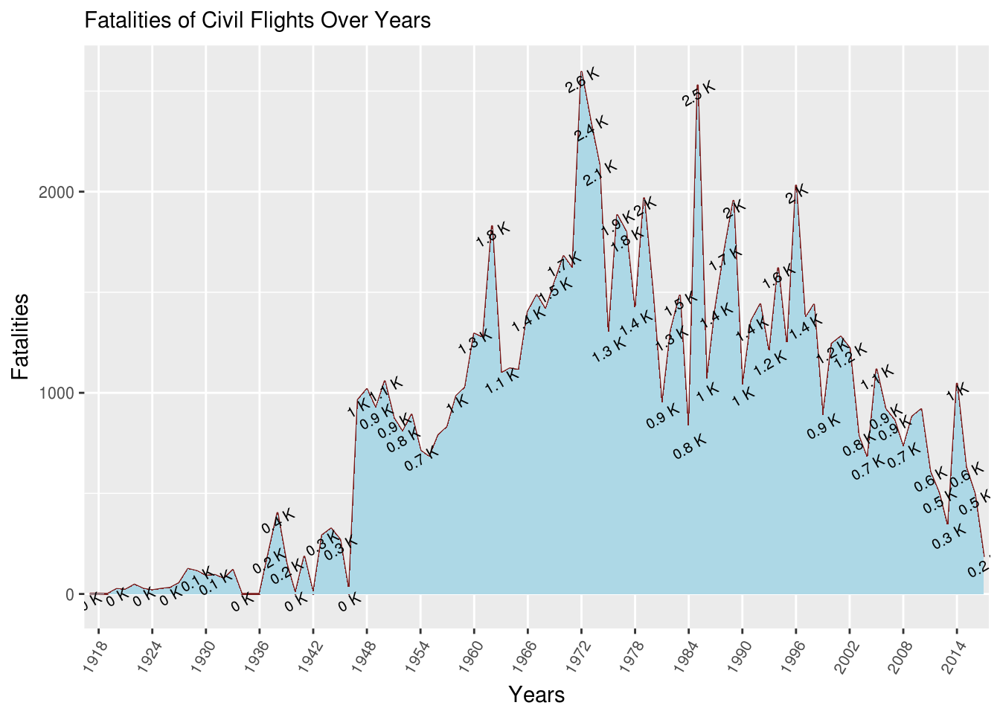 
```


## Top 10 Airplane Types & Crashes

```{r  out.width = "95%"}
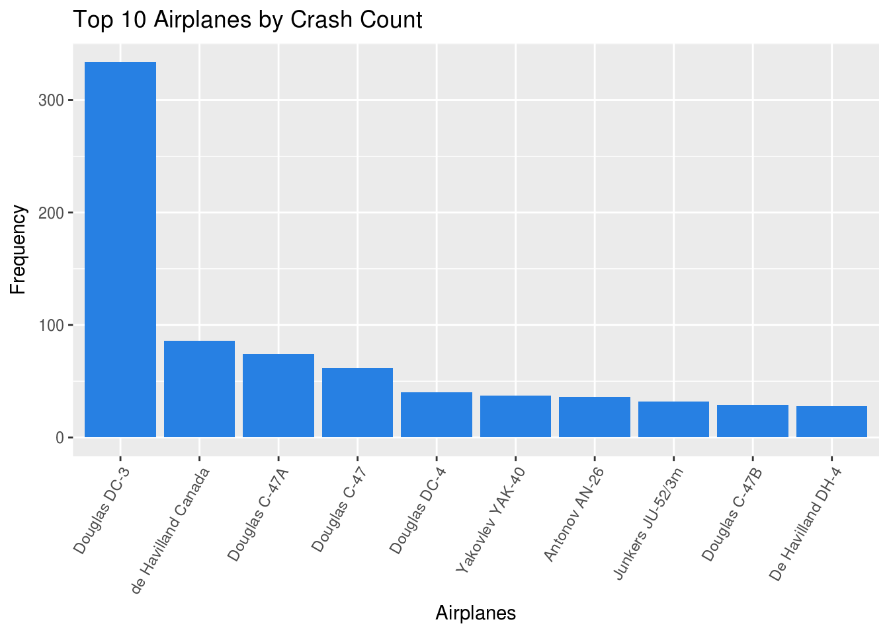 
```

## Comparing Accidents & Departures

```{r  out.width = "90%"}
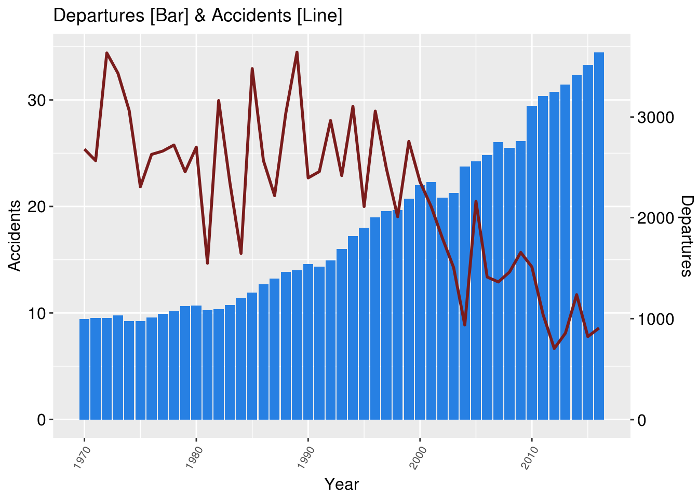 
```

## Top Civil Operators’ Crashes & Fatalities | Over Years

```{r  out.width = "45%"}
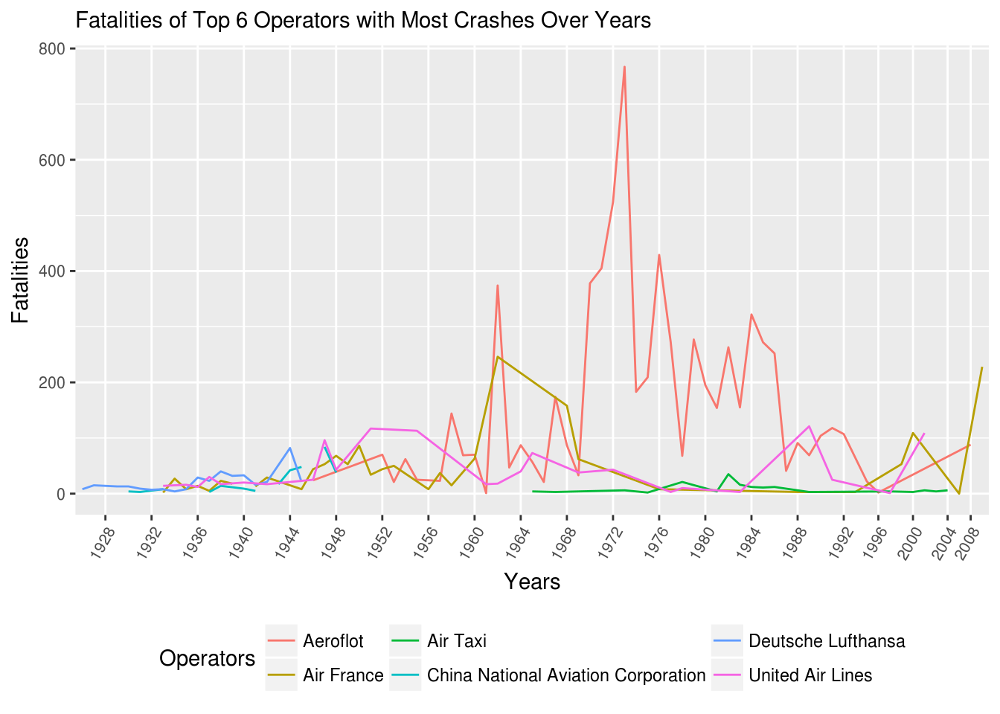 
```

```{r  out.width = "45%"}
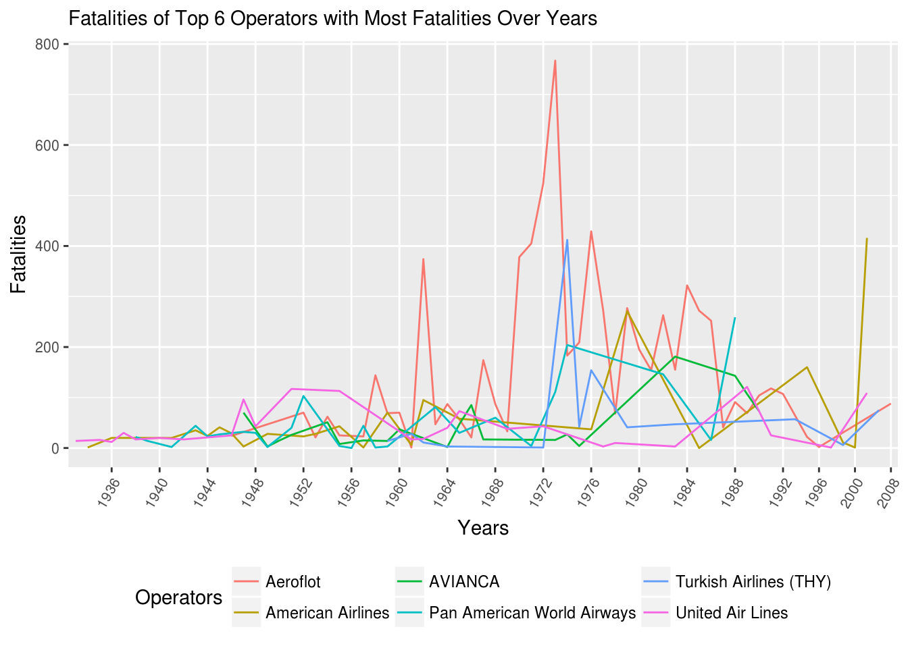 
```

## Crash History of Turkish Airlines

```{r  out.width = "80%"}
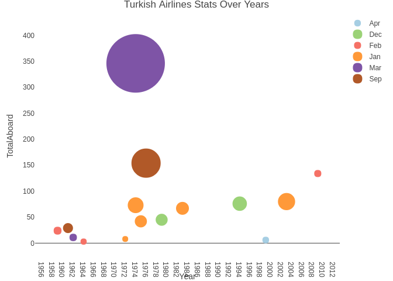 
```

## Fatalities & Total Passengers | Over Years

```{r  out.width = "80%"}
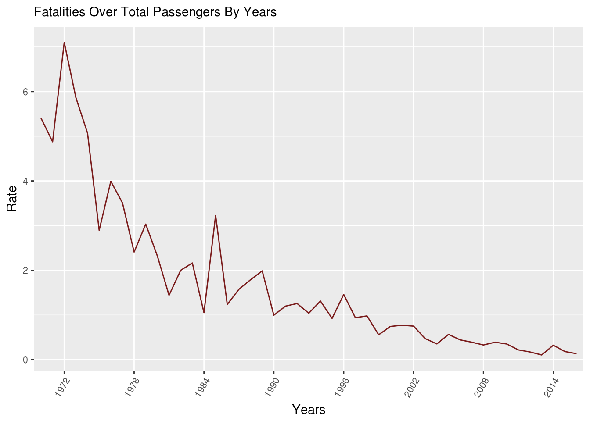 
```

## Has Survival Rate Increased Over Time?

```{r  out.width = "90%"}
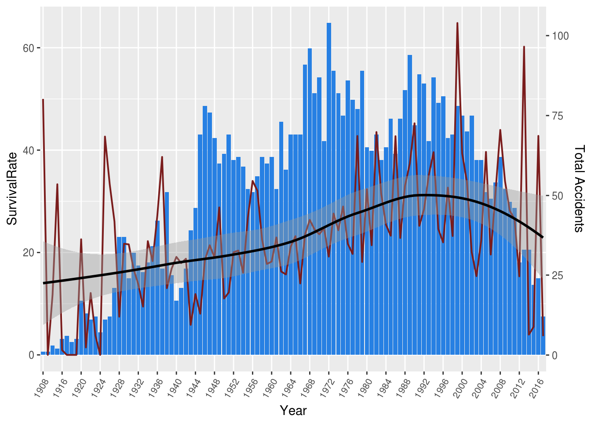 
```

## Possible Causes of Crashes | Word Cloud

```{r  out.width = "45%"}
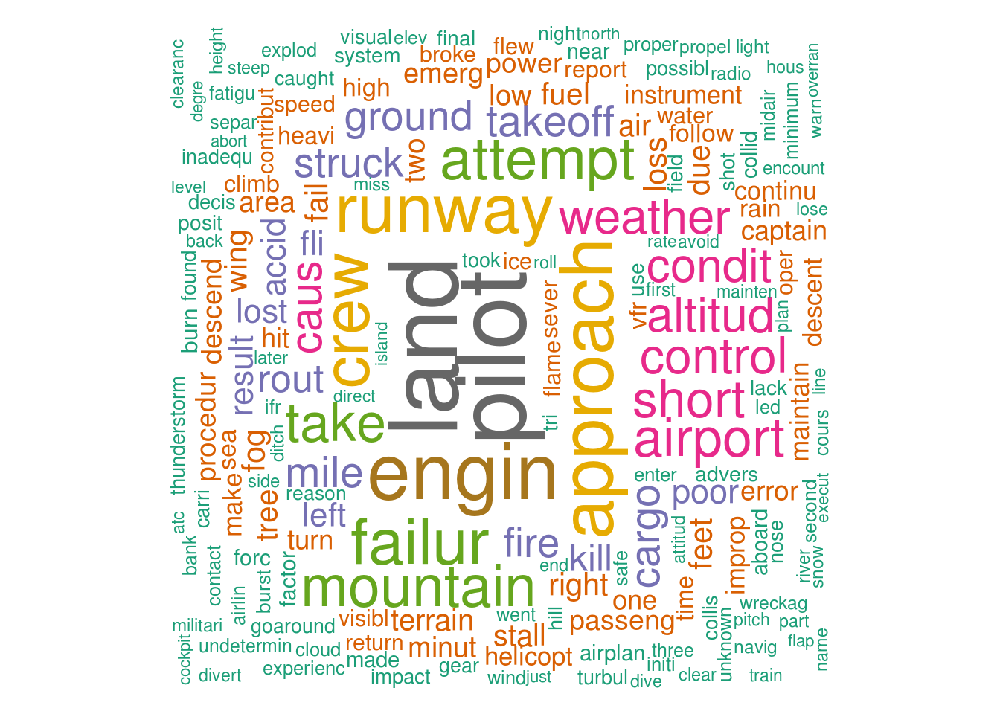 
```

```{r  out.width = "45%"}
 
```


## Where do accidents occur?

```{r  out.width = "45%"}
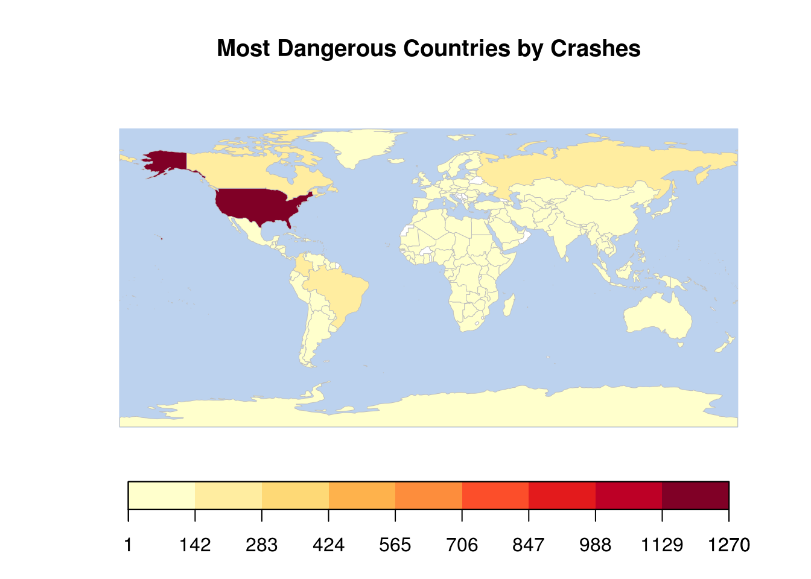 
```

```{r  out.width = "45%"}
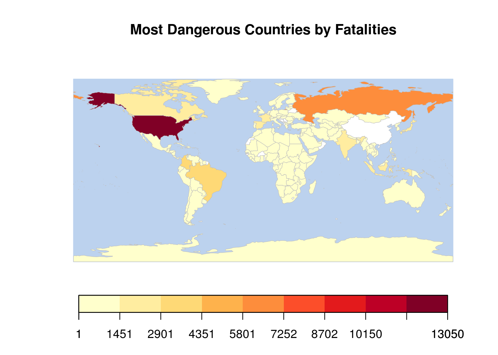 
```

## Conclusion

```{r  out.width = "75%"}
 
```
